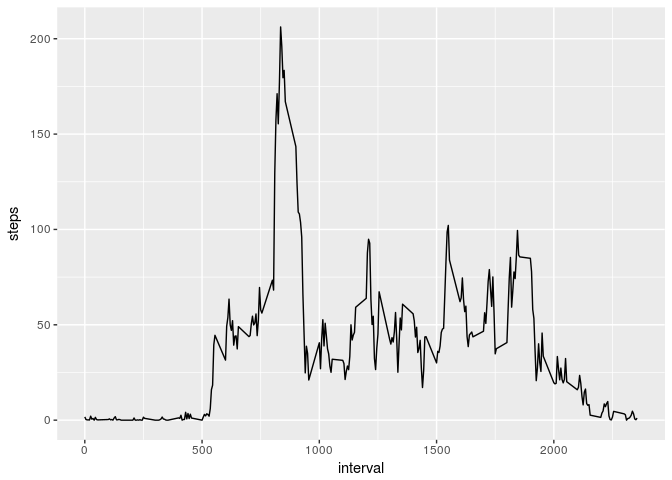

## Loading and preprocessing the data


```r
library(dplyr)
```

```
## 
## Attaching package: 'dplyr'
```

```
## The following objects are masked from 'package:stats':
## 
##     filter, lag
```

```
## The following objects are masked from 'package:base':
## 
##     intersect, setdiff, setequal, union
```

```r
library(ggplot2)
library(lubridate)
```

```
## 
## Attaching package: 'lubridate'
```

```
## The following object is masked from 'package:base':
## 
##     date
```

```r
steps <- read.csv("activity.csv") %>% mutate(date=as.Date(date))
summary(steps)
```

```
##      steps             date               interval     
##  Min.   :  0.00   Min.   :2012-10-01   Min.   :   0.0  
##  1st Qu.:  0.00   1st Qu.:2012-10-16   1st Qu.: 588.8  
##  Median :  0.00   Median :2012-10-31   Median :1177.5  
##  Mean   : 37.38   Mean   :2012-10-31   Mean   :1177.5  
##  3rd Qu.: 12.00   3rd Qu.:2012-11-15   3rd Qu.:1766.2  
##  Max.   :806.00   Max.   :2012-11-30   Max.   :2355.0  
##  NA's   :2304
```

## What is mean total number of steps taken per day?


```r
stepsperday <- steps %>% group_by(date) %>% summarise(steps=sum(steps))
meanstepperday <- mean(stepsperday$steps, na.rm = T)
medianstepperday <- median(stepsperday$steps, na.rm = T)

ggplot(stepsperday, aes(x=steps)) + geom_histogram(binwidth=500)
```

```
## Warning: Removed 8 rows containing non-finite values (stat_bin).
```

<!-- -->

The mean total number of steps taken per day is equal 1.0766189\times 10^{4} and the median number of steps is 10765.

## What is the average daily activity pattern?


```r
avgstepsperint <- steps %>% group_by(interval) %>% summarise(steps=mean(steps, na.rm = T))
ggplot(avgstepsperint, aes(x = interval, y = steps)) + geom_line()
```

<!-- -->

```r
maxstepint <- last(avgstepsperint$interval, order_by = avgstepsperint$steps)
maxstep <- max(avgstepsperint$steps)
```

The 835 is the interval with the highest average number of steps (206.1698113).

## Imputing missing values


```r
narows <- nrow(steps) - sum(complete.cases(steps))
```
Dataset contains 2304 rows with missing data. I will replace NAs with intervals mean rounded to the closest integer.


```r
nonasteps <- steps %>% inner_join(avgstepsperint, by='interval') %>% mutate(steps.z=round(steps.y), steps.z=as.integer(steps.z), steps=coalesce(steps.x, steps.z)) %>% select(steps, date, interval)

nonastepsperday <- nonasteps %>% group_by(date) %>% summarise(steps=sum(steps))
nonameanstepperday <- mean(nonastepsperday$steps)
nonamedianstepperday <- median(nonastepsperday$steps)

ggplot(nonastepsperday, aes(x=steps)) + geom_histogram(binwidth=500)
```

<!-- -->

After filling NAs we can see a new 'spike' around mean (10.7K). The mean and median stayed almost unafected. The new mean total number of steps taken per day is equal 1.0765639\times 10^{4} and the new median number of steps is 10762.


## Are there differences in activity patterns between weekdays and weekends?


```r
nonasteps$daytype <- as.factor(ifelse(wday(nonasteps$date) %in% c(1,7), "weekend", "weekday"))
nonaavgstepsperint <- nonasteps %>% group_by(daytype, interval) %>% summarise(steps=mean(steps))
ggplot(nonaavgstepsperint, aes(x = interval, y = steps)) + geom_line() + facet_wrap( ~ daytype)
```

<!-- -->

During the weekday there is a spike in the beginig of the day suggesting people exercise before work. DUring the weekend steps are distributed more evenly all day long.

